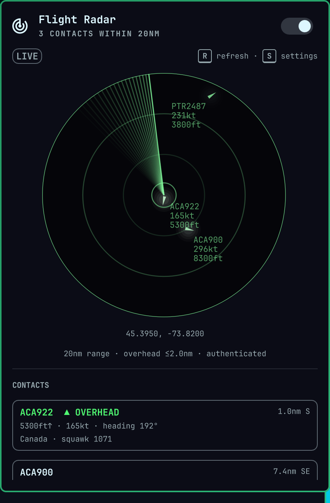

# Flight Radar — an Omarchy bar plugin

Live aircraft overhead on a micro-radar style scope, fed by the
[OpenSky Network](https://opensky-network.org).

A radar glyph sits in your bar. It carries a count badge when an aircraft is
overhead, and can raise a desktop notification as one arrives. Clicking it opens
a round scope with contacts drawn as heading triangles, in the colours of your
active Omarchy theme; clicking a contact opens it on the OpenSky flight map.



**No account needed.** It works out of the box on OpenSky's anonymous tier, and
with no coordinates configured it finds an approximate centre from your IP
address. Both can be improved from the panel's own settings — press **S** while
it is open — but neither is required.

## Install

```bash
omarchy plugin add https://github.com/yuters/omarchy-flight-radar
omarchy plugin enable yuters.flight-radar right
```

## Uninstall

```bash
omarchy plugin disable yuters.flight-radar
omarchy plugin remove yuters.flight-radar
```

## Attribution and terms

This plugin uses data from the OpenSky Network. Their
[terms of use](https://opensky-network.org/about/terms-of-use) ask that any
publication built on that data cite:

> **Bringing up OpenSky: A large-scale ADS-B sensor network for research**
>
> Matthias Schäfer, Martin Strohmeier, Vincent Lenders, Ivan Martinovic, Matthias Wilhelm
>
> ACM/IEEE International Conference on Information Processing in Sensor Networks, April 2014

and, to refer to the site itself, The OpenSky Network,
[opensky-network.org](https://opensky-network.org).

**Read the terms before you rely on this.** OpenSky licenses the data for
non-profit research and education, and as they are written today, *operational*
use of the REST API — integration into a live product, service or automated
system — requires a written licence from them regardless of whether you are a
non-profit. A desktop widget that polls the API on a timer is plausibly
operational use. Any commercial or for-profit use, contractors included, needs a
licence outright. Contact OpenSky at contact[at]opensky-network.org if either
applies to you.

OpenSky also blocks some IP ranges, cloud providers among them, in response to
misuse; if the radar cannot reach the API from a hosted environment, that is
expected and should be respected rather than worked around.

## Credits

- Scope design ported from [micro-radar](https://github.com/AnthonySturdy/micro-radar) by Anthony Sturdy
- Aircraft data from the [OpenSky Network](https://opensky-network.org), cited above
- Flight map links go to OpenSky's [tar1090](https://github.com/wiedehopf/tar1090) instance by wiedehopf
- Built for [Omarchy](https://omarchy.org) by DHH and contributors

## License

MIT — see [LICENSE](LICENSE).
